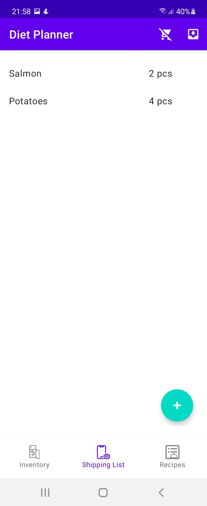
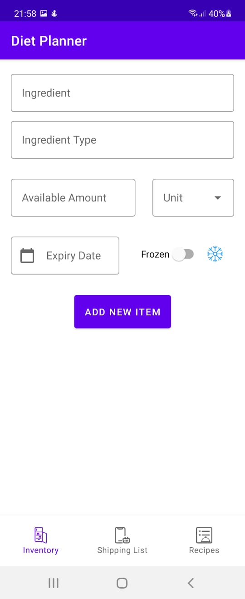
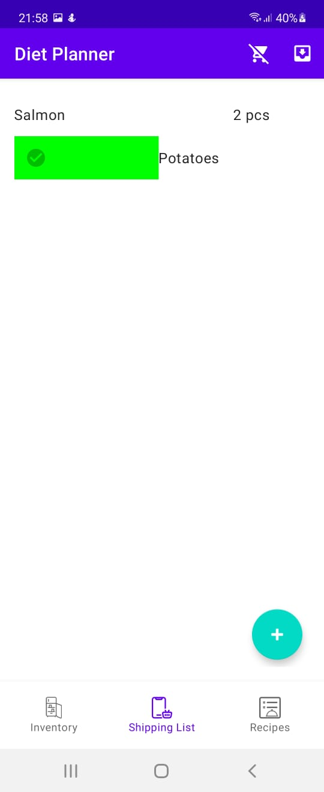
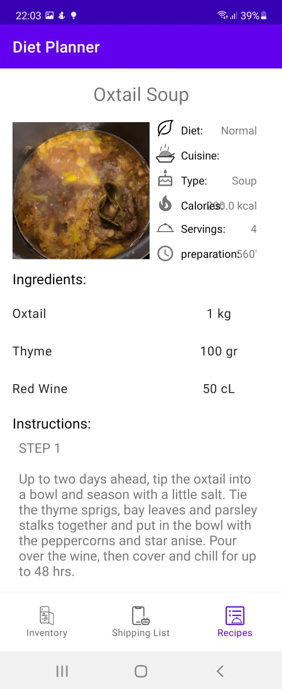
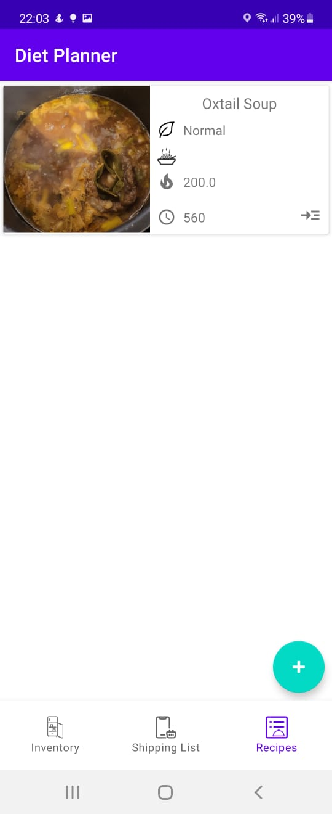
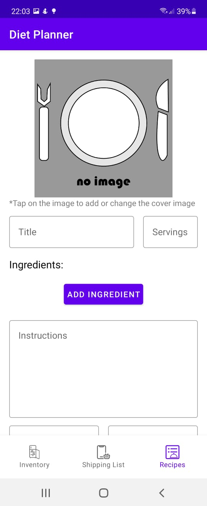

# Meal Planner

In this native Android the user can add the ingredients to their inventory inorder to keep track of the expiery dates. Creating a shopping list and recording recipes.

## Screenshots

<table>
  <tr>
     <td>Inventory Page</td>
     <td>Add Inventory Item Page</td>
     <td>Shopping List Page</td>
  </tr>
  <tr>
    <td></td>
    <td></td>
    <td></td>
  </tr>
 </table>

 <table>
  <tr>
     <td>Recipe Detail</td>
     <td>Recipes List Page</td>
     <td>Create Recipe Page</td>
  </tr>
  <tr>
    <td></td>
    <td></td>
    <td></td>
  </tr>
 </table>